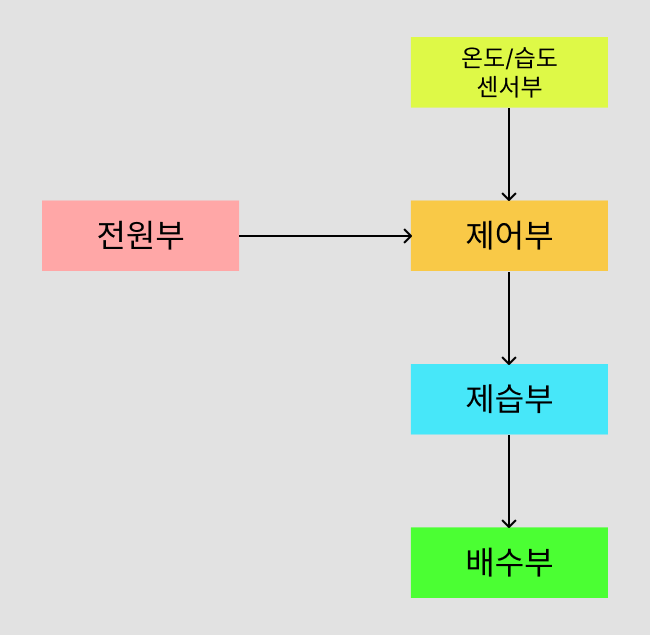

# 제습기 기본설계서

## 1. 개요

### 1.1 개발 목적

펠티어 소자를 이용하여 주변 공기의 습도를 제거할 수 있는
소형 제습기를 제작한다.

제습기의 기본적인 제어 기능을 구현하고,
향후 IoT 시스템과 연동할 수 있도록 확장 가능한 구조로 설계한다.

### 1.2 제습기 개요

본 시스템은 펠티어 소자의 냉각 효과를 이용하여
공기 중의 수분을 응축시키는 방식의 제습기이다.

온·습도 센서를 이용하여 주변 환경의 온도 및 습도를 측정하고,
측정된 습도와 설정된 동작 조건에 따라 펠티어 소자와 팬을 제어한다.

응축된 수분은 물탱크에 저장하며,
수위 감지를 통해 만수 상태에서는 제습 동작을 정지한다.

### 1.3 시스템 구성

본 시스템은 제어부, 센서부, 제습부, 전원부 및 배수부로 구성한다.

각 구성요소는 제어부를 중심으로 동작하며,
센서부에서 측정한 환경 정보를 기반으로 제습부 및 냉각/방열부를 제어한다.

#### 시스템 구성도

#### 구성요소

| 구성 | 설명 |
|---|---|
| 전원부 | 시스템 각 구성요소에 필요한 전원을 공급한다. |
| 제어부 | 센서 데이터를 수집하고 제습기의 동작을 제어한다. |
| 센서부 | 주변 습도 및 제습부의 온도를 측정한다. |
| 제습부 | 펠티어 소자를 이용하여 공기 중의 수분을 응축한다. |
| 배수부 | 제습 과정에서 발생한 응축수를 수집 및 저장한다. |

### 1.4 기본 동작

본 시스템은 주변 습도를 측정하고 설정된 습도 조건에 따라 제습 동작을 제어한다.

기본 동작은 다음과 같다.

1. 시스템에 전원이 공급되면 제어부 및 각 센서를 초기화한다.
2. 습도 센서를 통해 주변 습도를 측정한다.
3. 측정된 습도가 제습 시작 조건을 만족하면 제습 동작을 시작한다.
4. 제습 동작이 시작되면 펠티어 소자 및 팬을 동작시킨다.
5. 펠티어 소자의 냉각면에서 공기 중의 수분을 응축시킨다.
6. 발생한 응축수는 배수부를 통해 물탱크에 저장한다.
7. 제습 동작 중 주변 습도 및 제습부의 온도를 주기적으로 측정한다.
8. 목표 습도에 도달하면 제습 동작을 정지한다.
9. 과열 또는 결빙 등의 이상 조건이 감지될 경우 제습 동작을 정지한다.
10. 시스템은 다시 주변 습도를 측정하고 제습 필요 여부를 판단한다.

### 1.5 개발 환경

본 시스템의 제어 프로그램은 Raspberry Pi Pico 2 WH를 대상으로 C 언어를 사용하여 개발한다.

| 구분 | 개발 환경 |
|---|---|
| 개발 PC OS | Windows |
| Linux 환경 | WSL2 Ubuntu |
| 개발 도구 | Visual Studio Code |
| 프로그래밍 언어 | C |
| 제어 MCU | Raspberry Pi Pico WH |
| SDK | Raspberry Pi Pico SDK |
| 빌드 시스템 | CMake |
| 버전 관리 | Git / GitHub |
| 설계 문서 | Markdown / Figma |

## 2. 기능 설계

본 장에서는 펠티어 제습기가 제공하는 기능 및 각 기능의 동작 조건을 정의한다.

### 2.1 기능 목록

본 시스템에서 제공하는 기능은 다음과 같다.

| 기능 ID | 기능명 | 기능 개요 |
|---|---|---|
| FUNC-001 | 운전 제어 | 운전 버튼을 통해 제습기의 운전 ON/OFF 상태를 전환한다. |
| FUNC-002 | 습도 측정 | 주변 공기의 현재 습도를 측정한다. |
| FUNC-003 | 목표 습도 설정 | 습도 설정 버튼을 통해 목표 습도를 5% 단위로 설정한다. |
| FUNC-004 | 습도 표시 | 2자리 7-Segment를 통해 현재 습도 및 설정 습도를 표시한다. |
| FUNC-005 | 자동 제습 제어 | 현재 습도와 설정 습도를 비교하여 제습 동작을 자동으로 제어한다. |
| FUNC-006 | 펠티어 제어 | 제습 조건에 따라 펠티어 소자의 동작을 제어한다. |
| FUNC-007 | 팬 제어 | 제습 및 방열을 위해 팬의 동작을 제어한다. |
| FUNC-008 | 온도 감시 | 펠티어 냉각부 및 방열부의 온도를 감시한다. |
| FUNC-009 | 만수 감지 및 보호 | 물탱크의 만수를 감지하고 만수 상태에서 제습 동작을 정지한다. |
| FUNC-010 | 결빙 보호 | 냉각부 온도가 설정된 하한값 이하가 될 경우 제습 동작을 정지한다. |
| FUNC-011 | 과열 보호 | 방열부 온도가 설정된 상한값 이상이 될 경우 제습 동작을 정지한다. |
| FUNC-012 | 상태 표시 | RGB LED를 이용하여 운전, 만수 및 이상 상태를 표시한다. |
| FUNC-013 | 센서 이상 감지 | 센서의 측정 이상 또는 통신 이상을 감지하여 제습 동작을 제한한다. |
| FUNC-014 | Wi-Fi 설정 | 최초 사용 또는 네트워크 변경 시 Wi-Fi 접속 정보를 설정한다. |
| FUNC-015 | Wi-Fi 연결 | 저장된 Wi-Fi 정보를 이용하여 무선 네트워크에 접속한다. |
| FUNC-016 | Wi-Fi 연결 상태 관리 | Wi-Fi 연결 상태를 감시하고 연결이 끊어진 경우 재접속을 수행한다. |
| FUNC-017 | 상태 정보 송신 | 현재 습도, 설정 습도, 운전 상태 및 이상 상태 등의 정보를 외부 시스템으로 송신한다. |
| FUNC-018 | 원격 운전 제어 | 외부 시스템으로부터 운전 ON/OFF 명령을 수신하여 운전 상태를 제어한다. |
| FUNC-019 | 원격 습도 설정 | 외부 시스템으로부터 목표 습도 설정값을 수신하여 목표 습도를 변경한다. |
| FUNC-020 | 설정값 저장 | 설정된 목표 습도 및 시스템 설정 정보를 저장하고 재부팅 시 복원한다. |

### 2.2 FUNC-001 운전 제어

사용자의 조작에 따라 제습기의 운전 시작 및 정지를 제어한다.

시스템에 전원이 공급되는 동안 제어부, 습도 측정 및 통신 기능은 동작하며, 운전 상태는 제습 기능의 활성화 여부를 나타낸다.

#### 2.2.1 운전 상태

제습기의 운전 상태는 다음과 같이 구분한다.

| 운전 상태 | 설명 |
|---|---|
| OFF | 제습 기능이 비활성화된 대기 상태 |
| ON | 설정된 목표 습도에 따라 자동 제습이 가능한 상태 |

- 시스템 초기화 완료 후 운전 상태의 초기값은 OFF로 한다.
- 운전 상태와 실제 펠티어 소자의 동작 상태는 별도로 관리한다.
- 운전 OFF 상태에서도 습도 측정 및 외부 통신에 필요한 기능은 유지한다.

#### 2.2.2 본체 운전 제어

본체의 운전 터치 버튼을 터치할 때마다 운전 상태를 전환한다.

`OFF → ON → OFF`

- OFF 상태에서 운전 터치 버튼을 입력하면 운전 상태를 ON으로 전환한다.
- 운전 ON 시 저장되어 있는 목표 습도를 기준으로 자동 제습 제어를 시작한다.
- ON 상태에서 운전 터치 버튼을 입력하면 운전 상태를 OFF로 전환한다.
- 운전 OFF 전환 시 동작 중인 펠티어 소자 및 제습에 필요한 구동부를 정지한다.
- 운전 OFF 상태에서도 현재 습도 측정 및 외부 통신 기능은 유지한다.

#### 2.2.3 운전 상태와 제습 동작

운전 상태가 ON이라고 해서 펠티어 소자가 항상 동작하는 것은 아니다.

운전 ON 상태에서 현재 습도와 목표 습도 및 보호 상태를 확인하여 실제 제습 동작 여부를 결정한다.

| 운전 상태 | 제습 조건 | 보호 상태 | 제습 동작 |
|---|---|---|---|
| OFF | - | - | 정지 |
| ON | 미충족 | 정상 | 정지 |
| ON | 충족 | 정상 | 동작 |
| ON | - | 만수 또는 이상 | 정지 |

보호 조건이 발생한 경우 운전 상태와 관계없이 제습 동작을 정지한다.

#### 2.2.4 전원 재인가

- 시스템의 전원이 차단된 후 다시 인가된 경우 운전 상태는 OFF로 초기화한다.
- 이전 운전 ON/OFF 상태는 저장 및 복원하지 않는다.
- 저장된 목표 습도 및 Wi-Fi 설정 정보는 시스템 초기화 시 복원한다.

### 2.3 FUNC-002 습도 측정

주변 공기의 상대습도를 주기적으로 측정하여 현재 습도값으로 관리한다.

습도 측정은 운전 상태와 관계없이 시스템에 전원이 공급되는 동안 수행하며, 측정된 값은 자동 제습 제어, 습도 표시 및 외부 시스템으로의 상태 정보 송신에 사용한다.

#### 2.3.1 습도 측정

- 시스템 초기화가 완료되면 습도 측정을 시작한다.
- 운전 ON/OFF 상태와 관계없이 주변 공기의 습도를 주기적으로 측정한다.
- 측정된 습도는 상대습도(%RH) 단위로 관리한다.
- 정상적으로 취득된 최신 측정값을 현재 습도값으로 관리한다.
- 습도 측정 주기는 별도 제어 사양에서 정의한다.

#### 2.3.2 측정값 사용

측정된 현재 습도값은 다음 기능에서 사용한다.

| 사용 기능 | 용도 |
|---|---|
| 습도 표시 | 본체의 2자리 7-Segment에 현재 습도를 표시한다. |
| 자동 제습 제어 | 운전 ON 상태에서 현재 습도와 목표 습도를 비교하여 제습 동작 여부를 판단한다. |
| 상태 정보 송신 | 현재 습도값을 외부 시스템으로 송신한다. |

#### 2.3.3 측정 이상

- 습도 센서로부터 정상적인 측정값을 취득하지 못한 경우 해당 측정값을 유효한 현재 습도값으로 사용하지 않는다.
- 측정 이상 발생 시 이전 정상 측정값과 현재 측정 상태를 구분하여 관리한다.
- 센서 이상으로 판단된 경우 해당 습도값을 자동 제습 제어에 사용하지 않는다.
- 운전 중 습도 센서 이상이 발생한 경우 제습 동작을 정지한다.
- 센서 이상 판단 조건 및 보호 동작에 대한 상세 내용은 `FUNC-013 센서 이상 감지`에서 정의한다.

### 2.4 FUNC-003 목표 습도 설정

자동 제습 제어에 사용되는 목표 습도를 설정한다.

목표 습도는 본체의 습도 설정 터치 버튼 또는 외부 시스템의 원격 명령을 통해 변경할 수 있으며, 최종 설정값은 비휘발성 메모리에 저장한다.

#### 2.4.1 본체 목표 습도 설정

- 운전 ON 상태에서 습도 설정 터치 버튼을 터치하여 목표 습도를 변경한다.
- 습도 설정 터치 버튼을 한 번 터치할 때마다 목표 습도를 5% 단위로 증가시킨다.
- 목표 습도가 설정 가능한 최댓값에 도달한 상태에서 다시 터치하면 최솟값으로 전환한다.
- 변경된 목표 습도는 자동 제습 제어에 즉시 반영한다.
- 운전 OFF 상태에서는 본체 습도 설정 터치 입력을 통한 목표 습도 변경을 수행하지 않는다.

#### 2.4.2 설정 습도 표시

- 목표 습도 변경 시 2자리 7-Segment에 변경된 목표 습도를 표시한다.
- 목표 습도 표시 중 추가 터치가 입력되면 변경된 목표 습도를 즉시 갱신하여 표시한다.
- 마지막 습도 설정 입력 후 일정 시간이 경과하면 현재 습도 표시로 복귀한다.
- 현재 습도와 목표 습도는 상대습도(%RH) 단위로 관리한다.

#### 2.4.3 원격 목표 습도 설정

- 외부 시스템으로부터 목표 습도 변경 명령을 수신할 수 있다.
- 원격으로 변경된 목표 습도는 본체에서 설정한 목표 습도와 동일한 설정값으로 관리한다.
- 원격으로 목표 습도가 변경된 경우 변경값을 자동 제습 제어에 반영한다.
- 운전 OFF 상태에서 원격으로 목표 습도가 변경된 경우 설정값을 변경 및 저장하되 제습 동작은 시작하지 않는다.
- 이후 운전 상태가 ON으로 전환되면 변경된 목표 습도를 기준으로 자동 제습 제어를 수행한다.
- 원격 설정에 대한 상세 동작은 `FUNC-019 원격 습도 설정`에서 정의한다.

#### 2.4.4 설정값 확정 및 저장

- 목표 습도 변경 시 변경된 값을 자동 제습 제어에 즉시 반영한다.
- 본체에서 목표 습도를 연속적으로 변경하는 경우 마지막 입력 이후 일정 시간 동안 추가 입력이 없으면 해당 값을 최종 설정값으로 확정한다.
- 최종 확정된 목표 습도는 비휘발성 메모리에 저장한다.
- 연속적인 목표 습도 변경이 발생하는 경우 중간 설정값을 반복하여 저장하지 않고 마지막 설정값을 저장한다.
- 시스템 초기화 시 마지막으로 저장된 목표 습도를 복원한다.
- 저장된 목표 습도가 없거나 유효하지 않은 경우 기본 목표 습도값을 적용한다.
- 비휘발성 메모리의 불필요한 쓰기 횟수를 줄이도록 설정값 저장을 제어한다.

### 2.5 FUNC-004 습도 표시

2자리 7-Segment를 이용하여 현재 습도 및 목표 습도를 표시한다.

시스템에 전원이 공급되고 초기화가 완료되면 운전 ON/OFF 상태와 관계없이 현재 습도를 표시한다. 목표 습도 변경 시에는 설정된 목표 습도를 일시적으로 표시하고, 설정이 완료되면 현재 습도 표시로 복귀한다.

#### 2.5.1 현재 습도 표시

- 시스템 초기화가 완료되면 현재 습도를 2자리 7-Segment에 표시한다.
- 운전 ON/OFF 상태와 관계없이 현재 습도를 표시한다.
- 습도 센서에서 새로운 정상 측정값을 취득하면 표시값을 갱신한다.
- 현재 습도는 상대습도(%RH)의 정수값으로 표시한다.
- 시스템에 전원이 공급되는 동안 현재 습도 표시를 유지한다.

#### 2.5.2 목표 습도 표시

- 운전 ON 상태에서 습도 설정 터치 버튼이 입력되면 현재 습도 표시를 일시적으로 중단하고 변경된 목표 습도를 표시한다.
- 습도 설정 터치 버튼을 추가로 입력하면 변경된 목표 습도를 즉시 갱신하여 표시한다.
- 마지막 습도 설정 입력 후 일정 시간이 경과하면 현재 습도 표시로 복귀한다.
- 원격으로 목표 습도가 변경된 경우에도 변경된 목표 습도를 일시적으로 표시한다.

#### 2.5.3 표시 우선순위

현재 습도와 목표 습도 표시 조건이 동시에 발생한 경우 목표 습도 표시를 우선한다.

`목표 습도 > 현재 습도`

목표 습도 표시가 종료되면 최신 현재 습도값을 표시한다.

#### 2.5.4 습도 측정 이상 표시

- 정상적인 현재 습도값을 취득할 수 없는 경우 유효하지 않은 측정값을 표시하지 않는다.
- 습도 센서 이상이 확인된 경우 7-Segment에 측정 이상 상태를 표시한다.
- 센서 이상 발생 시 RGB LED를 RED로 표시한다.
- 7-Segment의 구체적인 이상 표시 방식은 표시 사양에서 정의한다.